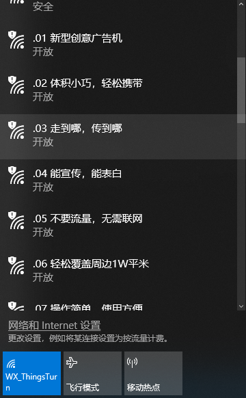
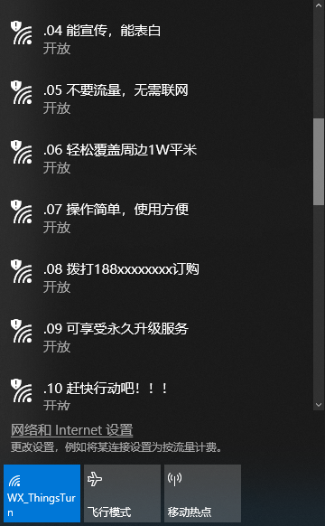

## W600 Beacon Spam

Use a W600  device to create multiple custom WiFi access points,  can be used for advertising.

Step 0: Compile and Download

``` 
wch@wch-pc /cygdrive/d/Project/sdk/example
$ ./build.sh beacon_spam flash COM3

start...

```

Step 1 :  UART0   Printf

```
w600 beacon spam example, compile @Apr 19 2019 11:56:01

task start ... 
```

Step 2:

Turn on the WiFi display on your computer or mobile phone

  


### About

Please visit www.thingsturn.com or contact support@thingsturn.com


